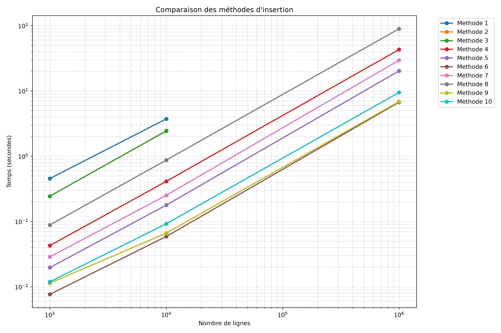

# Brief : insérer des données

## Mesures en secondes des differentes méthodes de copie : 
        
| # | Méthode | 1000 lignes |10 0000 lignes |1 000 000 lignes|
|---|---|---|---|---|
| 1 | `cursor.execute()` dans une boucle `for`, un `commit()` par ligne |0.45396925000386545 | 3.716525799994997 | N/A |
| 2 | `cursor.execute()` dans une boucle `for`, **un seul** `commit()` à la fin | 0.24382924999372335 | 2.4195678499963833 | N/A |
| 3 | `cursor.executemany()` | 0.24412589999701595 | 2.4362337499987916 | N/A |
| 4 | `psycopg2.extras.execute_batch()` (jouez sur `page_size`) | 0.04272405000665458 | 0.410662449998199 | 42.87709904999792 |
| 5 | `psycopg2.extras.execute_values()` (jouez sur `page_size`) | 0.019655150004837196 | 0.177762299994356 | 20.20878009999433 |
| 6 | `COPY` via `cursor.copy_expert()` + `StringIO` |0.00764204999723006  |0.0587949000109802  |6.689683550001064  |
| 7 | `pandas.to_sql()` par défaut |0.028642450000916142  |0.250993900008325  |29.42560014999617  |
| 8 | `pandas.to_sql(method='multi', chunksize=...)` | 0.08824270000332035 | 0.8696305500052404 |89.18170919999102  |
| 9 | `pandas.to_sql(method=callable)` branché sur `COPY` | 0.011352850000548642 |0.06612305000453489|6.855719049999607|
| 10| `COPY` via un itérateur (sans tout charger en mémoire) | 0.011899249999260064 |0.09206384999561124|9.451808800004073|

## Graphique des durées d'execution en fonction du nombre de lignes: 

## Analyse des résultats