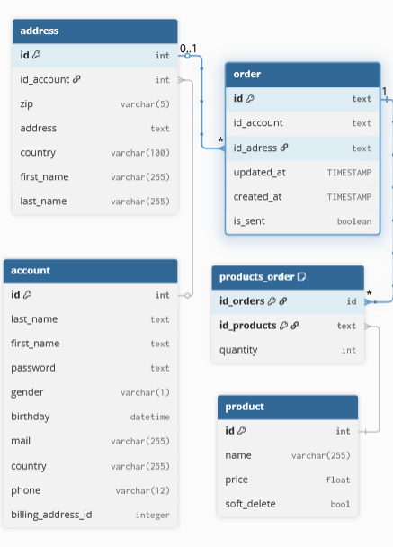
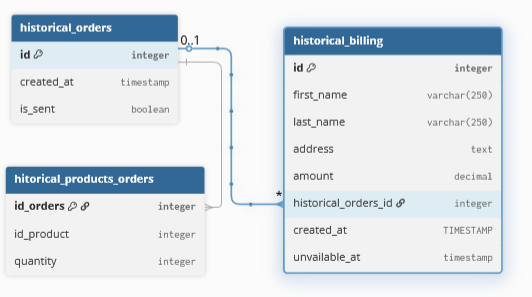
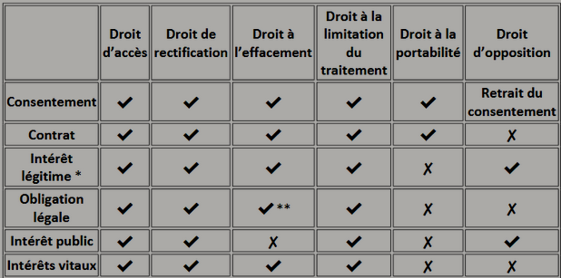
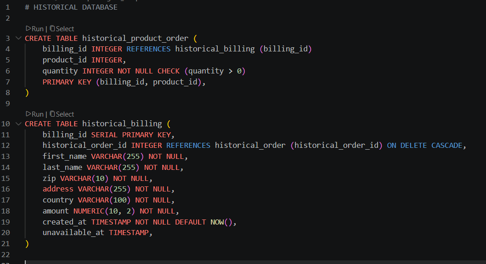
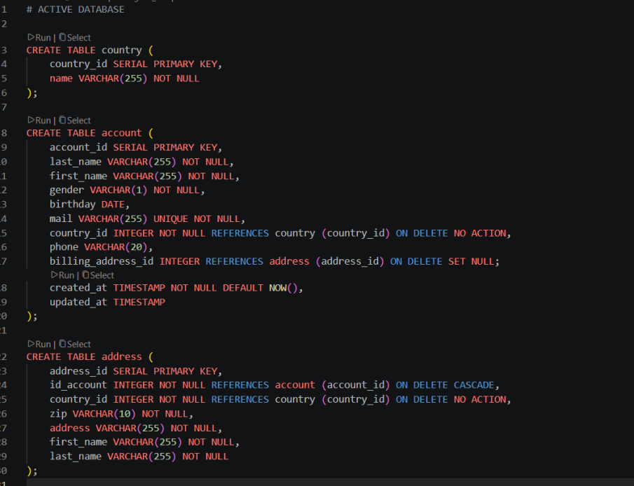
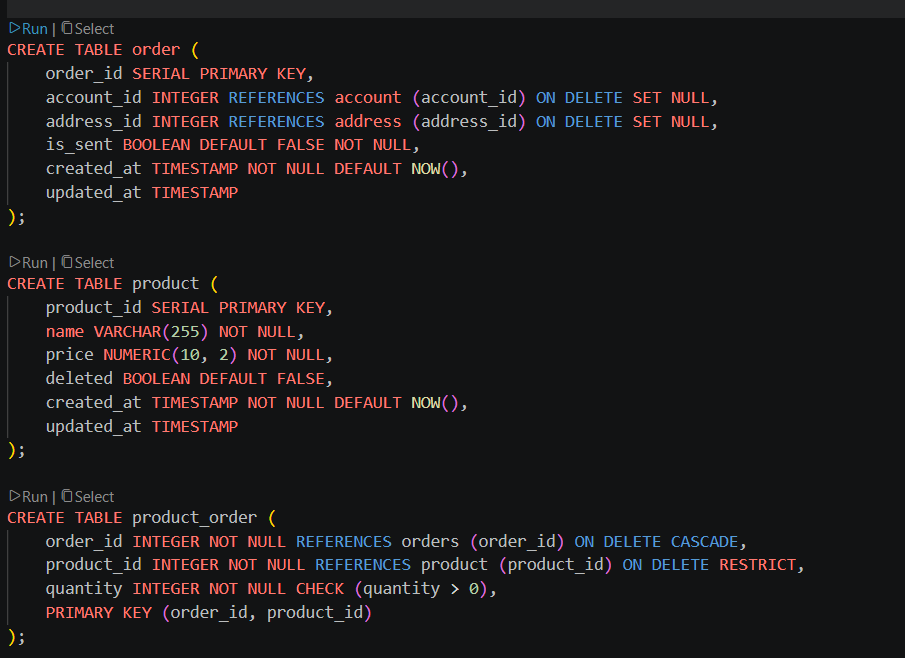

# I. Rapport

**# LDLC RGPD**

**# 1.** Choisir un site

* LDLC - entreprise française  
* Site e-commerce de matériel informatique


  
**# 2.** Choisir une fonctionnalité et la modéliser

Fonctionnalité : Gestion de panier et historique de facturation

**TABLES**

 

 

**# 3.** Identifier les données personnelles

- ID : non personnelle  
- prénom : personnelle directe  
- nom : personnelle directe  
- email : personnelle indirecte  
- téléphone : personnelle directe  
- adresse de facturation: personnelle indirecte  
- adresse de livraison : personnelle indirecte

par recoupement :

- country - gender - bday (retrouver quelqu’un)  
- shippment_address - user.country (déduire les déplacements)  
- shippment - tel (retrouver historique d’achat de quelqu’un)  
- updated / created - réseaux sociaux (retrouver la commande avec data temporelles)

Données commerciales optionnelles:

- gender  
- country (account)  
- birthday

**# 4.** Rédiger une ébauche de mentions légales

L'entreprise “LDLC” numéro de SIREN 403 554 181, au statut de SA détenant un capital social de 1 110 919,68 €. Ayant pour adresse *2 rue des Erables, CS21035, 69000 LIMONEST***, joignable au _[06.XX.XX.XX.XX](http://06.XX.XX.XX.XX)_ et sur son mail[[kevin.pepega@gmail.com](mailto:kevin.pepega@gmail.com)](https://www.youtube.com/watch?v=dQw4w9WgXcQ) représentée par Kévin PEPEGA agissant et ayant les pouvoirs nécessaires en tant que Directeur général. Le Directeur de la publication : Laurent de la Clergerie.

Informations sur l’hébergeur du site : Groupe LDLC, Adresse de l'hébergeur : *2 rue des Erables – CS21035 – 69000 Limonest CEDEX***. Numéro de téléphone : __[04.XX.XX.XX.XX](http://04.XX.XX.XX.XX)__ du lundi au vendredi de 9h00 à 12h30 et de 13h45 à 18h (heure de Paris). 

Activités principales de l’objet social : Vente de tous matériels et logiciels informatiques et de tous services pouvant s'y rattacher, en direct, par correspondance, par voie de commerce électronique ainsi que par l'intermédiaire de réseaux de franchisés, lié au code APE : 4791B - Vente à distance sur catalogue spécialisé. Référence RCS 403 554 181 , numéro de TVA intracommunautaire : FR26403554181.

**## CGU & CGV**

Pour les Conditions Générales de ventes : [CGV]([https://www.youtube.com/watch?v=dQw4w9WgXcQ](https://www.youtube.com/watch?v=dQw4w9WgXcQ)) et les Conditions Générales d’Utilisation : [CGU](https://www.youtube.com/watch?v=dQw4w9WgXcQ).

**## Médiation**

Le médiateur de la consommation dont relève LDLC est le suivant : Nom : CM2C. Adresse postale : *49 Rue de Ponthieu 75008 PARIS*. 

**## RGPD**

Vous pouvez accéder ici à notre réglementation sur la protection des données : [ici]([https://www.youtube.com/watch?v=dQw4w9WgXcQ](https://www.youtube.com/watch?v=dQw4w9WgXcQ))

Conformément aux recommandations de la CNIL, la durée maximale de conservation des cookies est de 13 mois au maximum après leur premier dépôt dans votre terminal, tout comme la durée de la validité du consentement de votre consentement à l’utilisation de ces cookies. La durée de vie des cookies n’est pas prolongée à chaque visite. Votre consentement devra donc être renouvelé à l'issue de ce délai. Des moyens de purge de données sont mis en place afin de prévoir la suppression effective des cookies.

Vous souhaitez nous contacter concernant l’utilisation de vos données personnelles : vous disposez d'un droit d'accès, de portabilité, de modification, de rectification et de suppression des données qui vous concernent selon les législations européenne et française relatives à la protection des données personnelles. Vous pouvez, à tout moment, demander que vos contributions soient supprimées. Les demandes concernant le droit d’accès, de portabilité, de modification et de rectification doivent être adressées par courrier ou par courriel, accompagnées d’un justificatif d’identité aux coordonnées suivantes :

Email:  dpo@xxxxxx.com  
Adresse postale: *DPO GROUPE LDLC, ***2 rue des Erables, 69000 Limonest***

Les informations de paiement sont conservées pendant 13 mois suivant la date de débit et jusqu’à 15 mois pour les débits différés.   
Concernant notre facturation clientèle sont archivées pendant 10 ans à partir de la clôture de l’exercice conformément aux règles de la Chambre de Commerce.

**## Cookies - Finalité et base légale de traitement**

Nous utilisons des cookies afin de rendre votre expérience meilleure à chaque utilisation si vous souhaitez les supprimer, dirigez vous vers les préférences de votre navigateur internet. Certains cookies sont nécessaires au bon fonctionnement du site. Deux types sont utilisés sur notre site web :

- Cookies obligatoires pour le bon fonctionnement du site

Exemples : Authentification, panier, préférence de navigation, historique

- Cookies facultatifs pour des fins statistiques et marketing

Exemples : Metrics, tracking, publicité, etc

Ces finalités doivent répondre à l’article 6 de la RGPD :

- le consentement  
- l’exécution contractuelle  
- l’obligation légale  
- la sauvegarde des intérêts vitaux  
- la mission d’intérêt public  
- l’intérêt légitime

 

**## Propriété intellectuelle**

Les images, illustrations et photographies des produits présentés sont détenus par les marques de ces mêmes produits. Nous vous informons que toute représentation totale ou partielle du site, des logos sont formellement interdites. 

**## Espace utilisateur et commentaire**

Merci de nous contacter pour tout contenu illégal ou illicite dépendant de l’espace commentaire sur [contact]([https://www.youtube.com/watch?v=dQw4w9WgXcQ](https://www.youtube.com/watch?v=dQw4w9WgXcQ)).

**# 5.** Concevoir le process de suppression en cas d'invocation du droit à l'effacement

En cas d’invocation du droit à l’effacement :  
	

- Suppression lignes table account   
- Suppression lignes table address

# II. Database

**# ACTIVE DATABASE**

 

**# HISTORICAL DATABASE**





# III. Conservation en DB

```Bases légales: Obligation légale,Intérêt légitime, Intérêt vital, Consentement, Contrat, Intérêt Public  
				Durée conservation/objectif/raison légale  
Table order {		  
  id : Jusqu’à passage commande/commande/légitime       
  id_account : Jusqu’à passage commande/commande/légitime  
  id_adress : Jusqu’à passage commande/commande/légitime  
  updated_at : Jusqu’à passage commande/commande/légitime  
  created_at : Jusqu’à passage commande/commande/légitime  
  is_sent : Jusqu’à passage commande/commande/légitime  
}

Table account{  
  id : Jusqu’à suppression/commande+facturation/légal  
  last_name : Jusqu’à suppression/commande+facturation/légal  
  first_name :Jusqu’à suppression/commande+facturation/légal  
  password : Jusqu’à suppression/commande+facturation/légal  
  gender : Jusqu’à suppression/commande+facturation/légal  
  birthday : Jusqu’à suppression/commande+facturation/légal  
  mail : Jusqu’à suppression/commande+facturation/légal  
  country : Jusqu’à suppression/commande+facturation/légal  
  phone : Jusqu’à suppression/commande+facturation/légal  
  billing address_id : Jusqu’à suppression/commande+facturation/légal  
}

Table products_order{  
  id_orders : Jusqu’à passage commande/commande/légitime  
  id_products : Jusqu’à passage commande/commande/légitime  
  quantity : Jusqu’à passage commande/commande/légitime  
}

Table product {  
    id : non personnel  
    name : non personnel  
    price : non personnel  
    soft_delete : non personnel  
}```

```Table address{  
    id : Jusqu’à suppression/commande+facturation/légal  
    id_: Jusqu’à suppression/commande+facturation/légal  
    zip : Jusqu’à suppression/commande+facturation/légal  
    address : Jusqu’à suppression/commande+facturation/légal

    country : Jusqu’à suppression/commande+facturation/légal  
    first_name : Jusqu’à suppression/commande+facturation/légal  
    last_name : Jusqu’à suppression/commande+facturation/légal  
}

Ref : products_order.id_orders > [order.id](http://order.id)   
Jusqu’à passage commande/commande/légitime  
Ref : products_order.id_products > [product.id](http://product.id)  
Jusqu’à passage commande/commande/légitime  
Ref : address.id_account> [account.id](http://account.id)  
Jusqu’à suppression/commande+facturation/légal  
Ref : order.id_adress > address.id  
Jusqu’à passage commande/commande/légitime

Table historical_orders{  
  id integer pk               10 ans/historique facturation/légal  
  created_at timestamp		10 ans/historique facturation/légal  
  is_sent boolean			10 ans/historique facturation/légal  
}

Table hitorical_products_orders{  
  id_orders integer pk 10 ans/historique facturation/légal  
  id_product integer    10 ans/historique facturation/légal  
  quantity integer    10 ans/historique facturation/légal  
}

Table historical_billing{  
  id : 10 ans/historique facturation/légal  
  first_name : 10 ans/historique facturation/légal  
  last_name : 10 ans/historique facturation/légal  
  address : 10 ans/historique facturation/légal  
  amount : 10 ans/historique facturation/légal  
  historical_orders_id integer   10 ans/historique facturation/légal  
  created_at :10 ans/historique facturation/légal  
  unavailable_at :10 ans/historique facturation/légal  
}

Ref : historical_billing.historical_orders_id > historical_orders.id  
10 ans/historique facturation/légal  
Ref : hitorical_products_orders.id_orders > historical_orders.id  
10 ans/historique facturation/légal

DiagramView Default {  
  Schemas {  
    public  
  }  
  Notes { * }  
}```

# IV. Référence

[https://www.societe.com/societe/groupe-ldlc-403554181.html](https://www.societe.com/societe/groupe-ldlc-403554181.html)  
[https://fr.wikipedia.org/wiki/Obligations_l%C3%A9gales_sur_Internet_en_France](https://fr.wikipedia.org/wiki/Obligations_l%C3%A9gales_sur_Internet_en_France)  
[https://www.drawio.com/docs/tutorials/crows-foot-notation/](https://www.drawio.com/docs/tutorials/crows-foot-notation/)  
[https://dbdiagram.io/d/6a30023c5c789b8acb88b4b2](https://dbdiagram.io/d/6a30023c5c789b8acb88b4b2)

# Brief

# Brief RGPD : modéliser une fonctionnalité et rédiger ses mentions légales

> Module réglementaire obligatoire (compétence C11, niveau 1 : créer une base de données dans le respect du RGPD).

En partant d'un site marchand français, vous reconstituerez le travail de conception derrière une de ses fonctionnalités :   
- le schéma de données  
- l'analyse des données personnelles  
- les mentions légales associées

> Compétence visée (RNCP-37638) : **C11, niveau 1-2** : « créer une base de données dans le respect du RGPD en élaborant les modèles conceptuels et physiques des données à partir des données préparées et en programmant leur import afin de stocker le jeu de données du projet ». Niveau 1 : cas guidé, avec accompagnement.

## Situation professionnelle emblématique

MCD - Vous êtes data engineer dans une agence qui réalise des sites marchands.  
- Un client vous confie la conception de la base d'une fonctionnalité de son futur site marchand.   
- Avant d'écrire la moindre ligne de SQL, on attend deux choses de vous : un modèle de données qui tient la fonctionnalité, et une analyse RGPD qui dit ce qui relève de la donnée personnelle et comment le site doit informer ses utilisateurs.

Le délégué à la protection des données (DPO) du client vous demande de documenter vos choix : ce dossier servira au registre des traitements et aux mentions légales publiées sur le site. 

**⚠️ La conformité se construit à la modélisation et se justifie par écrit.**

## 1. Choisir un site

Un site qui valide les deux conditions :

- **français** : éditeur établi en France, soumis au droit français et au RGPD ;  
- **marchand** : il vend un produit ou un service en ligne (e-commerce, réservation, abonnement, place de marché…).

## 2. Choisir une fonctionnalité et la modéliser

Prenez **une** fonctionnalité précise, pas le site entier. Quelques exemples : la création de compte, le panier et la commande, l'avis client, la liste de souhaits, la réservation d'un créneau, le programme de fidélité, l'abonnement à la newsletter etc...

Pour cette fonctionnalité :

- imaginez le **schéma SQL** représentant les données nécessaires à son bon fonctionnement, et rien de plus. Vous appliquer principe de minimisation : une colonne qu'on ne sait pas justifier ne se crée pas.  
- livrez-le en (Mermaid `erDiagram` ou crow's foot) **et** en `CREATE TABLE` PostgreSQL, avec clés primaires, clés étrangères et contraintes (`NOT NULL`, `UNIQUE`, au moins un `CHECK`).

- [Crow's foot](https://www.drawio.com/docs/tutorials/crows-foot-notation/)  
- [Entity Relationships](https://www.drawio.com/docs/diagram-types/entity-relationship-tables/)

Trois ou quatre tables liées suffisent. Par exemple pour un site de e-commerce : `client`, `commande`, `ligne_commande`, `produit`.

## 3. Identifier les données personnelles

- Reprenez votre schéma colonne par colonne : pour chaque donnée, dites si elle est personnelle et pourquoi.   
- Rappel de l'article 4 du RGPD : est personnelle toute information se rapportant à une personne physique **identifiable**, directement ou indirectement.

*⚠️ Le coeur de l'exercice, c'est l'**indirect** : listez les données et surtout les **combinaisons de données** qui, croisées, permettent de remonter à une personne, même sans son nom.*

- une donnée seule : email, téléphone, adresse de livraison, numéro client ;  
- une combinaison : code postal + date de naissance + sexe suffit à ré-identifier une part importante de la population ; historique d'achats + horaires de connexion + ville ; adresse IP + horodatage etc...

Présentez ça en tableau : `donnée | personnelle ? | directe / indirecte | justification (base légale)`. Et une ligne par combinaison ré-identifiante repérée.

> Piège à ne pas rater : une donnée « anonyme » en apparence (un identifiant interne, un code postal) cesse de l'être dès qu'on peut la recouper. 

## 4. Rédiger une ébauche de mentions légales

Rédigez les mentions légales du site, en veillant à n'**oublier aucune mention obligatoire**. Le cas d'un site marchand français cumule trois sources : la LCEN (article 6), le Code de commerce, et le RGPD. La checklist de contrôle :

**Identification de l'éditeur**  
- raison sociale et forme juridique (SARL, SAS…), montant du capital social ;  
- adresse du siège social ;  
- numéro RCS et ville d'immatriculation, numéro SIRET ;  
- numéro de TVA intracommunautaire ;  
- coordonnées de contact (email, téléphone) ;  
- nom du directeur de la publication.

**Hébergeur**  
- nom (ou raison sociale), adresse et téléphone de l'hébergeur du site.

**Activité commerciale (B2C)**  
- renvoi aux conditions générales de vente ;  
- information sur le médiateur de la consommation (obligatoire pour la vente aux particuliers).  
- tout autre médiateur ou mention obligatoire pour les professions réglementées.

**Protection des données (RGPD)**  
- identité du responsable de traitement, et du DPO s'il existe ;  
- finalités et base légale du traitement ;  
- durée de conservation des données ;  
- droits des personnes : accès, rectification, effacement, opposition, portabilité, limitation ;  
- droit d'introduire une réclamation auprès de la CNIL ;  
- information sur les cookies et le recueil du consentement.

🟠 Vous veillerez à bien indiquer quels sont les délais de conservation des données, qui peut être variable.

**Propriété intellectuelle**  
- mention sur les droits relatifs aux contenus du site.

Une ébauche réaliste : remplissez avec des valeurs plausibles (ou les vraies, si le site les publie) plutôt que des `[à compléter]` partout. **Le but est de montrer que vous savez quelles mentions sont dues et pourquoi.**

## 5. Concevoir le process de suppression en cas d'invocation du droit à l'effacement

Rédiger la liste des instructions à suivre dans le cas où un utilisateur ferait valoir son droit à l'effacement. 

## Livrables

| Livrable | Forme |  
|---|---|  
| Le site choisi et la fonctionnalité, en deux lignes | dans le `.md` |  
| Le schéma de la fonctionnalité | MCD (Mermaid) + `CREATE TABLE` |  
| L'analyse des données personnelles | tableau données + tableau combinaisons ré-identifiantes |  
| L'ébauche de mentions légales | section rédigée, checklist couverte |

Un seul fichier Markdown versionné dans le dépôt + éventuelles images ou fichiers pour le schéma SQL.

## Indicateurs de performance

Ce qui sera regardé pour valider la compétence :

- le MCD et les `CREATE TABLE` sont cohérents entre eux et couvrent la fonctionnalité choisie, sans table ni colonne superflue ;  
- les contraintes d'intégrité sont posées et pertinentes (clés primaires, clés étrangères, `NOT NULL`, `UNIQUE`, au moins un `CHECK` justifié) ;  
- la minimisation est appliquée : chaque colonne se rattache à la finalité, et les colonnes écartées sont justifiées ;  
- l'analyse des données personnelles distingue identification directe et indirecte, et repère au moins une combinaison ré-identifiante propre au schéma ;  
- les mentions légales couvrent l'intégralité de la checklist (éditeur, hébergeur, activité commerciale, RGPD, propriété intellectuelle), sans mention obligatoire manquante ;  
- le volet RGPD est complet et exact : finalité, base légale, durée de conservation, droits des personnes, réclamation CNIL, cookies.

## Modalités pédagogiques

- Module réglementaire en présentiel, intégré aux 4h RGPD de la phase 1.   
- Travail en binôme, en autonomie accompagnée : le formateur passe valider le choix du site et de la fonctionnalité avant la modélisation.   
- Durée indicative : une demi-journée.  
- 🔴 Aucun usage de LLM ne sera toléré pour ce brief.  
- 🟠 Il est préférable de ne pas s'inspirer des mentions légales du site que vous choisirez.

## Modalités d'évaluation

Le travail est rendu sous forme de commit git. Un barème simple suit les indicateurs de performance ci-dessus : modèle (cohérence et minimisation), analyse des données personnelles (justesse et combinaisons), mentions légales (exhaustivité). Une courte restitution orale (5 minutes) peut être demandée pour défendre les arbitrages RGPD. 

